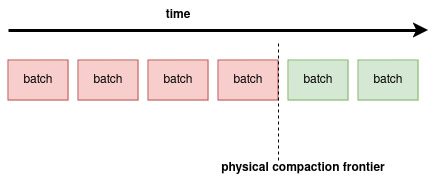
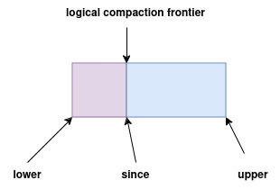

# Differential Dataflow Arrangement
[Differential Dataflow] (后面简称 DD) 是基于 [Timely Dataflow] (后面简称 TD) 的流式数据处理引擎, 提供了 `join`, `reduce`, `iterate` 等核
心 operator, 有些 operator 执行的时候需要数据的历史状态, Arrangement 就是用来存储数据状态的.逻辑上等价于 `Vec<(Key, Value, Timestamp, Diff)>`, 实际上所有的数据变更历史(Update)是存在一个叫 `Trace` 的结构里, `Trace` 是一个 trait, 用户可以自己实现.

## Trace
`Trace` 是由连续的 `Batch` 组成, 这里的连续是指时间维度上的. 大概长这样

每个 `Batch` 大概长这样:

`Batch` 是指包含一个时间段内的数据, DD 中的 `Batch` 实现是一个不可变的数据结构. 主要包含以下信息
- Data: `Vec<(Key, Value, Timestamp, Diff)>`
- Lower: 代表时间下界, 满足 `lower.less_equal(Data::Timestamp)`
- Upper: 代表时间上界, 满足 `!upper.less_equal(Data::Timestamp)`
- Since: 指定可以查询 `Batch` 中的最小时间, 下面会有详细说明.

`Trace` 为了满足高效随机查询的要求, 需要保证 `Batch` 的需要保持一个较小的数量, DD 中实现 `Trace` 的结构叫 `Spine`, `Batch` 的数量为 (log2 n). 所以 `Trace` 中的
`Batch` 需要支持 merge:

进行合并的 `Batch` 需要满足:
- batch 必须是相邻的, `batch1.upper == batch2.lower`
- batch 必须在 `physical compaction frontier` 之前, `batch.upper.less_equal(physical_compaction_frontier)` 

### Physical Compaction Frontier
有些用到 `Trace` 的 operator, 比如 `join`, `count` 等, 这些算子每次执行的时候需要记录
`Trace` 中读取到的位置,以便在下次执行的时候使用这个位置信息来执行一些操作. 这个位置一般是 `Batch` 之间的边界(upper 或者 lower), 但是
`Trace` 会随时 merge batch, 导致这个边界随着 `Batch` 之间的 merge 而消失不见,这样
的话依赖这些边界的算子将无法正常工作,为了防止这种情况, `Trace` 提供了 `set_physical_compaction` 方法, 这样 `Trace` 只能 merge `physical compaction frontier` 之前的 `Batch`, 后续的 `Batch` 将保持原封不动.

上述算子通过 `Trace::cursor_through(upper)` 来读取数据,由于上面说过的原因, 这个 `upper` 需要满足 `physical_compaction_frontier.less_equal(upper)`. 

### Logical Compaction Frontier
默认情况下 `Trace` 包含所有历史变更记录, 这样产生的一个问题是随着时间的推移, 数据量将不断
扩大, 通过 `Trace::set_logical_compaction` 设置一个时间 **T**, **T** 之前的变更记
录将会合并, 比如某条数据 `D` 的时间轴为 `(1,2,3,4,5)`, 那么设置 `T == 3` 之后, 时间轴
将变为`(3,4,5)`, `D` 在 `(1,2)` 时刻的状态将无法查询, 但是整体的数据量将要减少.

`Spine` 的 `logical compaction frontier` 是作用在即将 merge 的 `Batch` 上的, 新产生的 `Batch` 的 `since'` 满足
`since' = batch1.since ∨ batch2.since ∨ logical_compaction_frontier` 
在 merge 过程中, `since'` 之前的历史状态将被合并.

在时间满足 TotalOrder 的情况下, `since'`只会包含一个时间点, 历史数据的时间只要提升到这
个时间点即可. 但是在 PartialOrder 下, `since'`可能包含多个时间点, 历史数据的是时间如何
处理? 答案是通过 `Lattice::advance_by(since')`, [Materialize Formalism] 提到了
具体的原理:
>When sliding an update to a new time, which time is optimal? By "optimal", we mean the time which minimizes the number of downstream times which are not at or after since--in essence, how close can we slide an update at time t to the frontier since while preserving correctness? As Appendix A of the K-Pg SIGMOD paper shows, the answer is:
**t' = meet (for all s in since) join(t, s)**

### Trace Agent
`Trace` 设计成可以在不同的算子中共享(甚至可以是跨 dataflow 的算子), 这样可以大大减少内
存的暂用, 但是这些依赖 `Trace`的算子需啊维护各自的`logical_compaction_frontier`, 
`physical_compaction_frontier`, 如何设置 `Trace` 的这两个 frontier 使得满足
所有依赖它的算子?.

DD 引入了 `TraceAgent<Trace>` 用来解决这个问题, 首先在设置 compaction frontier 的
时候, `TraceAgent` 会 join 这两个 frontier, 这样就能保证 `old_frontier.less_equal(new_frontier)`, 如果没有这个 join 操作, `new_frontier` 可能在 `old_frontier`
之前, 甚至它两可能有交叉的地方, 我们必须保证 compaction frontier 的单调性, 不然的话 compaction frontier 将毫无意义.

其次 `Trace` 的共享是通过 `TraceAgent::clone` 来完成的, 假设我们通过 clone 产生了两个
`TraceAgent` 分别是 `TA`, `TB`,  那么最终的 `frontier1 = TA.froniter.extend(TB.frontier)`
这里面的 extend 对应 `Antichain::extend` (如果你还没看到过 `Antichain`, 那你真的是有点..., 开玩笑, 后面应该会专门写一篇文章讲一下 DD 中的基础概念.)
通过这个操作后 `frontier1` 满足: `frontier1.less_equal(TA.frontier) && frontier1.less_equal(TB.frontier)`, 这样不同算子可以各自 advance 自己的 frontier
而不影响到其他算子.

最后在说明一下 `TraceAgent::drop`, 我们继续上面那个例子, 假设 `TB` drop 了, 那么最终
的 `frontier2 = TA.frontier`, 我们可以很清楚的得出 `frontier1.less_equal(frontier2)`
这样子 compaction frontier 的单调性也得到了保证.

#### Trace 跨 Dataflow 共享
TODO

### Trace::Exert
前面提到 `Trace` 内部有一个 compact `Batch` 的机制, 当 `Batch` 过大的时候, compact
可能会消耗过多的时间, dataflow 的 latency 就会增加. 所以 `Trace` 提供了一种机制能够
避免这种情况, 那就是 `Trace::set_exert_logic(ExertionLogic)`, 这个 `ExertionLogic` 其实是个自定义的函数 `f: (&[Batch]) -> usize`, 输入 `Trace`中当前
的 `[Batch]`, 返回一个整数, 代表最大工作量, DD 中称这个整数为 fuel, 中文是燃料的意思. 大概原理是当 merge 工作的时候, 每产生一条新的数据, fuel 就减 1, 直到 merge 完成 或者 
fuel < 0 为止, 如果没有完成的话就调用 `activator` 在下个 dataflow 周期继续工作. 这样
的话就把单次 merge 的时间限制到了一定的范围以内, dataflow 的 latency 就不会剧烈抖动.

其实 DD 中的 Join 算子也有类似机制, 我们自己编写新的算子的时候也要考虑这个情况.

### 总结
这篇文章描述了一下 `Trace` 的大致形状以及与它相关的一些操作, 希望能使读者有个大概的了解
. `Trace` 的其他很多细节其实没有讲到, 包括 `Trace` 的构建, `Spine` 的具体操作过程
`Trace` 的性能特征等, 这些只有去看源代码才能更好的理解(Read The FFFFantastic  Code).

[Differential Dataflow]: https://github.com/TimelyDataflow/differential-dataflow
[Timely Dataflow]: https://github.com/TimelyDataflow/timely-dataflow
[Materialize Formalism]: https://github.com/MaterializeInc/materialize/blob/main/doc/developer/platform/formalism.md#ptvc-compaction