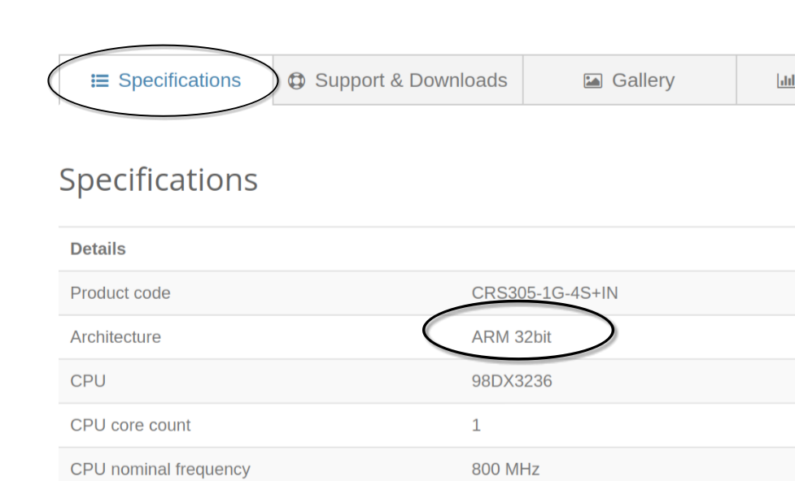
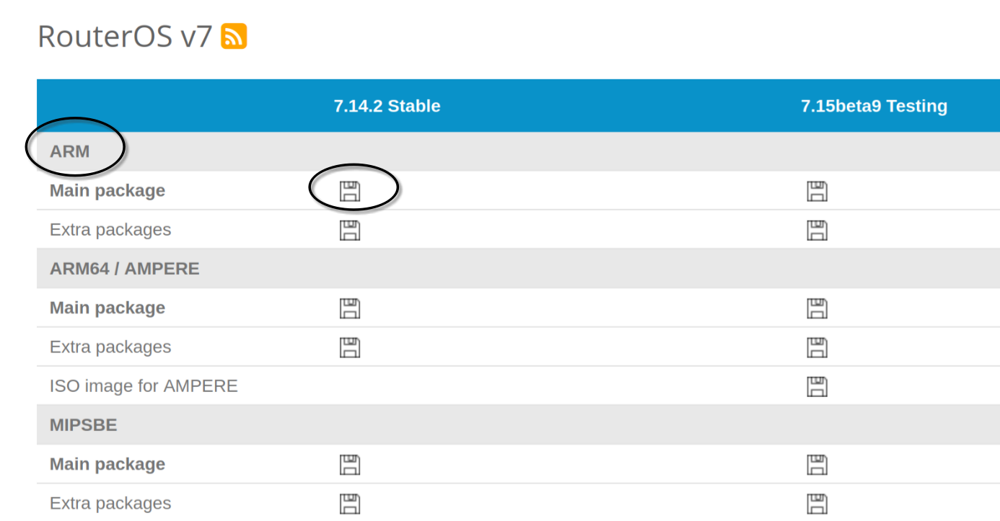
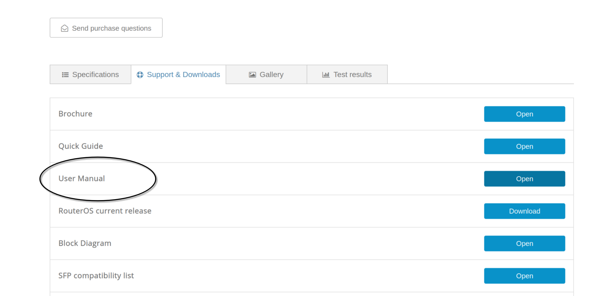

# RouterOS Netinstall

这篇文章记录下如何在 Linux 上使用 Netinstall 来安装 RouterOS，ROS 文档网站其实已经有[相关文档](https://help.mikrotik.com/docs/display/ROS/Netinstall)
描述使用 Netinstall 的方法，但是主要集中在 Window 上，对 Linux 上的使用姿势描述的不是特别清楚，这篇文章会记录下各个具体的操作步骤
方便后续安装 ROS。

## 准备工作
首先在[官网下载页面](https://mikrotik.com/download)下载 ROS 系统以及 Netinstall (CLI Linux)，注意这个页面里面包含了所有架构的 RouterOS
我们需要选择设备对应的架构，这个可以在产品页的 Specifications 里找到
比如[这个](https://mikrotik.com/product/crs305_1g_4s_in#fndtn-specifications)
的架构是 ARM 32bit，所以我们要下载 ARM 架构的 ROS（64位对应的架构是 ARM64). 
还有一点要注意的是很多 Linux 发行版的软件包仓库中可能
已经有了 Netinstall,但是还是建议大家在官网下载，这样可以保证 ROS 和 netinstall 版本的一致性，减小出错的可能。我自己一开始就在 AUR
上下载了 Netinstall 但是发现命令行参数都和官网的 Netinstall 不一致，也没有安装成功，白白浪费了很多时间.

下载完了之后把文件放在一个目录下并解压
```
mkdir test
mv netinstall-7.14.2.tar.gz test/
mv routeros-7.14.2-arm.npk test/
tar -xzf netinstall-7.14.2.tar.gz
```
解压之后的文件是 netinstall-cli，这个是我们后面安装 ROS 的工具。


## 安装 ROS
首先断开设备的电源端口，然后用一条网线把电脑和设备连接起来，设备那边连接的端口一般是第一个端口，或者有标记 **BOOT**, **MGMT**.
然后在电脑这边在对应的端口上配置 IP 信息，这里我配置的地址是 192.168.88.2/24, gateway 是 192.168.88.1，不同的工具有不同的配置方式，这里
暂且略过，注意的地方是这个地址不能现有的地址冲突，如果有冲突的话，换一个地址就好了。断开其他所有连接。

然后让设备进入 netinstall 模式，具体步骤是
- 按住 reset 按键，一般用一根细一点的针顶住就好,不要松开。
- 接通电源
- 过一回 reset 旁边的灯会闪烁，20秒左右后灯会暗掉，这个时候可以松开 reset。

reset 按钮还有其他作用，这个可以在[用户手册](https://mikrotik.com/product/crs305_1g_4s_in#fndtn-downloads)中找到,


然后进入准备工作中创建的 `test` 目录执行 netinstall
```bash
cd test
sudo ./netinstall-cli -r -b -a 192.168.88.3 ./routeros-7.14.2-arm.npk
```
这里的参数分别说明一下:
- r: ros 会清空之前的设置，使用默认设置。这里也可以是 e, 这样连默认设置也不会有，相当创建了最干净最原始的系统.
- b: 忽略之前安装的一些 package, 如果不加这个选项的话，这些包会重新安装
- a: 分配给设备的 ip
- 最后一个参数就是我们的安装包

执行命令之后会出现类似下面的输出：
```shell
Version: 7.14.2(2024-03-27 08:33:46)
Will reset to default config
Will remove branding
Interface Mask: 255.255.255.0
Using Client IP: 192.168.88.3
Using Server IP: 192.168.88.2
Starting PXE server
Waiting for RouterBOARD...
```
如果一直卡在最后一步，重新拔插一下网线就可以往下走（这一步非常的诡异，我是尝试了一万次才试出来的），最后的输出是这个样子:
```shell
Version: 7.14.2(2024-03-27 08:33:46)
Will reset to default config
Will remove branding
Interface Mask: 255.255.255.0
Using Client IP: 192.168.88.3
Using Server IP: 192.168.88.2
Starting PXE server
Waiting for RouterBOARD...
client: 48:8F:5A:D3:72:CB
Detected client architecture: arm
Sending and starting Netinstall boot image ... 
Installed branding package detected
Discovered RouterBOARD...
Formatting...
Sending package routeros-7.14.2-arm.npk ...
Ready for reboot...
Sent reboot command
```

等待设备重启完成后就可以在浏览器输入 192.168.88.1 进到 ROS 的 WEB 页面。至此说明我们的安装成功了。