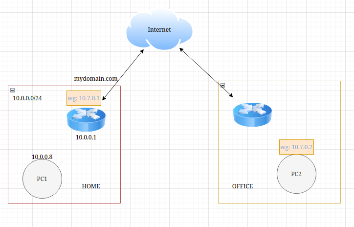

# Wireguard Practice
今天实操一下在 mikrotik ros 系统上配置 wireguard, ros 实际上自带了一个自动化配置wireguard 的功能: [Back To Home](https://help.mikrotik.com/docs/spaces/ROS/pages/197984280/Back+To+Home), 但是为了练手的目的我会自己尝试配置一下.
这篇文章会搭建一种叫 [Point to Site](https://www.procustodibus.com/blog/2020/10/wireguard-topologies/#point-to-site) 的拓扑结构, 在这个例子中 Site 代指家里,
Point 代指公司的电脑, 我们的需求是通过公司的电脑能够访问家庭网络, 比如说可以在工作日午休
的时候连上家里的 Nas 看看电影.同时我们还要求在家里的电脑也能够访问公司的电脑,这样半夜紧
急修 Bug 的时候也不用因为没有开发环境而苦恼.
写本文的时候我还没有完整的在 ros 上配置过 wireguard, 等会我会边配置边记录(请原谅我的不够严谨).


## 前置条件.
- 一台 ros 路由器
- 公网 IP(联通宽带很容易获取,打个电话一般就给你了,其他运营商的不太清楚)

由于运营商给你公网 IP 一般都是动态的,所以还需要配置 DDNS, ros 直接支持配置 DDNS, 在开启ddns 之后系统会分配一个域名给我们, 这里假定分配的域名是 `mydomain.com`, 后面的配置都会基于这个域名来进行.

开启 ddns
```
/ip cloud set ddns-enabled=yes
```

## 基础网络结构



- wireguard 网络: 10.7.0.1/24
    - home wireguard 网关: 10.7.0.1
    - 办公室 PC2: 10.7.0.2
- home 网络: 10.0.0.1/24
    - home ros 网关: 10.0.0.1
    - home PC1: 10.0.0.8
- office 网络: 这个由公司同学设定
    - 办公室 PC2: 使用 DHCP 获取 IP 即可

我们的需求是能够实现 PC1 与 PC2 之间的互相访问.


## ROS 上的 wireguard 配置

```
# 添加 wireguard interface
/interface/wireguard
add listen-port=13231 name=testwg1

# 添加 peer, 这个 peer 代指 PC2, 这里的 private-key 可以用 `wg genkey` 生成
/interface/wireguard/peers
add comment="PC2" allowed-address=10.7.0.2/32 interface=testwg1 private-key="sGb861bXE7uJvBn3EIv0FHaJQXVrmnWk3ZPz8jxM21A="

# 添加 ip 地址给 testwg1
/ip address
add address=10.7.0.1/24 interface=testwg1 comment="testwg1"

# 添加防火墙规则, 默认情况下防火墙会禁止外部网络连接内网, 这里添加例外条件
/ip/firewall/filter
add action=accept chain=input dst-port=13231 protocol=udp place-before=0 comment="testwg1"
```
TODO: 说明 NAT 的使用场景


## 客户端配置

创建配置文件 testwg1.conf
```
[Interface]
PrivateKey = sGb861bXE7uJvBn3EIv0FHaJQXVrmnWk3ZPz8jxM21A=
Address = 10.7.0.2/32

[Peer]
PublicKey = Rxxy1sl5Tio9eUP1mhdX0RoG/nvjAg55QqzbQjrJwFs=
AllowedIPs = 10.0.0.0/24
Endpoint = mydomain.com:13231
```

然后使用 wg-quick 就能配置后客户端网络
```
wg-quick up ./testwg1.conf
```
这样客户端就配置好了, 这时候 PC2 ping PC1(10.0.0.8) 就能成功.但是反过来 PC1 ping PC2 (10.7.0.2) 不一定成功
因为家里的 ros 最开始的时候并不感知办公室的外网地址 (endpoint), 那怎么办呢? 我们可以设置 PersistentKeepalive 参数
让 PC2 定期向 PC1 发送心跳包, 下面是 wg man 页面对这个参数的解释
> The use of persistent-keepalive is optional and is by default off; setting it to 0 or "off" disables it.  Otherwise it represents, in seconds, between 1 and
>               65535 inclusive, how often to send an authenticated empty packet to the peer, for the purpose of keeping a stateful firewall or NAT mapping valid persistently. For example, if the  interface  very
>               rarely  sends  traffic,  but  it might at anytime receive traffic from a peer, and it is behind NAT, the interface might benefit from having a persistent keepalive interval of 25 seconds; however,
>               most users will not need this.


这样 ros 就能感知到 PC2 的 endpoint, 发送心跳还能使得 office 路由器维护外网地址与 PC2 
内网地址的映射, 这样的话 PC1 到 PC2 的链路就通了.

完整的配置文件
```
[Interface]
PrivateKey = sGb861bXE7uJvBn3EIv0FHaJQXVrmnWk3ZPz8jxM21A=
Address = 10.7.0.2/32

[Peer]
PublicKey = Rxxy1sl5Tio9eUP1mhdX0RoG/nvjAg55QqzbQjrJwFs=
AllowedIPs = 10.0.0.0/24
Endpoint = mydomain.com:13231
PersistentKeepalive = 30
```

## 总结
这篇文章简单的配置一个 wireguard point to site 的例子,相对来说还是比较简单的,其中一个缺点是需要手工配置密钥,很多成熟
的隧道方案都不要人工操作密钥,比如说 zerotier, tailscale 等. 优点是简单,并且不需要第三方服务. 针对刚才说的对于密钥管理
的缺点, 我觉得最主要的一个点是如何存放密钥, 因为我是多年 1password 的用户,我第一个想到的就是它, 而且 1password 有 API
能够读取/写入里面的内容, 所有我的想法是创建一个应用, 配置信息(包括密钥)存入 1password, 然后提供一些命令:
- 生成 ros 配置, 并且能够通过 ros api 更新配置.
- 生成 wg 命令接收的参数, 这些参数和上面 wg-quick 使用的配置文件类型.
- 能够方便的添加 peer

后面工具开发完成之后(希望可以...) 我会再开一篇文章单独讲讲. Ok, 今天就到此为止吧.


## 参考
- [Wireguard 官方介绍](https://www.wireguard.com/)
- [Wireguard Quickstart](https://www.wireguard.com/quickstart/)
- [WireGuard Endpoints and IP Addresses](https://www.procustodibus.com/blog/2021/01/wireguard-endpoints-and-ip-addresses/)
- [Primary WireGuard Topologies](https://www.procustodibus.com/blog/2020/10/wireguard-topologies/)
- [Mikrotik Wireguard](https://help.mikrotik.com/docs/spaces/ROS/pages/69664792/WireGuard)
